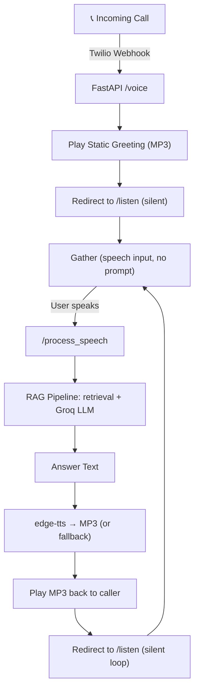

# 🎙️ Voice‑to‑Voice RAG Assistant – Disaster Management (Nepali)

> A production‑ready voice assistant that answers disaster‑related queries in Nepali via phone, using a hybrid RAG pipeline (Vector + BM25) and a Groq LLM, all accessible via Twilio.

---

## 📌 Overview

This project implements a **voice‑in / voice‑out** assistant that can be called via a phone number. It:

- Accepts spoken Nepali queries through a Twilio phone number.
- Transcribes speech using Twilio's built‑in STT.
- Retrieves relevant information from a local knowledge base (disaster management) using a hybrid retrieval system (ChromaDB vector search + BM25).
- Generates a precise, conversational answer in Nepali using Groq's LLM.
- Speaks the answer back using **edge‑tts** (natural‑sounding Nepali voice) or falls back to Twilio's `<Say>`.
- Supports multi‑turn conversations without extra prompts – just silence after the greeting and answers.

---

## ✨ Key Features

- **📞 Phone Integration:** Works with any phone – just call your Twilio number.
- **🧠 Hybrid RAG:** Combines dense retrieval (ChromaDB) and sparse retrieval (BM25) with keyword boosting for high‑accuracy context.
- **🗣️ Natural Nepali TTS:** Uses Azure's `ne‑NP‑HemkalaNeural` voice via `edge‑tts` for answers; static prompts are pre‑generated.
- **⚡ Optimised for Speed:** Pre‑generated static MP3s (greeting, retry, goodbye) reduce latency; dynamic answers use edge‑tts directly.
- **🛡️ Resilient:** Graceful fallbacks for API errors, TTS failures, or out‑of‑scope questions.
- **📡 Cloudflare Tunnel:** Uses `cloudflared` for a free, reliable public URL without interstitial pages.

---

## 🛠️ Tech Stack

| Component | Technology / Library |
| :--- | :--- |
| **Backend API** | [FastAPI](https://fastapi.tiangolo.com/) |
| **Voice Gateway** | [Twilio](https://www.twilio.com/) (Voice, Speech‑to‑Text) |
| **Text‑to‑Speech** | [`edge-tts`](https://github.com/rany2/edge-tts) (Azure Neural TTS) |
| **Vector Store** | [ChromaDB](https://www.trychroma.com/) |
| **Sparse Retriever** | BM25 (via `rank_bm25`) |
| **LLM** | [Groq](https://groq.com/) (e.g., `openai/gpt-oss-20b` or `llama3-70b-8192`) |
| **Embeddings** | `sentence-transformers/paraphrase-multilingual-MiniLM-L12-v2` |
| **Tunneling** | [Cloudflare Tunnel](https://developers.cloudflare.com/cloudflare-one/connections/connect-networks/) (`cloudflared`) – free, no interstitial |
| **Language** | Python 3.9+ |

---

## 🏗️ Architecture & Flow



---

## 🚀 Getting Started

### Prerequisites

- Python 3.9+
- A [Twilio](https://www.twilio.com/) account with a phone number (trial works).
- A [Groq](https://console.groq.com/) API key.
- [Cloudflare Tunnel](https://developers.cloudflare.com/cloudflare-one/connections/connect-networks/) (`cloudflared`) installed.
- `edge-tts` and the required dependencies.

### 1. Clone & Install Dependencies

```bash
git clone https://github.com/NischalGirii/voice-to-voice
cd voice-to-voice
pip install -r requirements.txt
```

**requirements.txt** (example):
```
fastapi
uvicorn[standard]
twilio
edge-tts
groq
langchain-huggingface
langchain-chroma
rank-bm25
python-dotenv
```

### 2. Set Up Environment Variables

Create a `.env` file in the project root:

```ini
GROQ_API_KEY=your_groq_api_key_here
TWILIO_ACCOUNT_SID="your_twilio_SID"
TWILIO_AUTH_TOKEN="your_twilio_AUTH"
TWILIO_PHONE_NUMBER="your_twilio_number"
BASE_URL="https://your-cloudflare-domain.trycloudflare.com"
```

### 3. Prepare Your Knowledge Base

Place your documents (text files) in the `data/` folder. Run the ingestion script to build indices:

```bash
python src/ingestion/ingestion.py
```

This creates:
- `data/chroma_db/` – Chroma vector store.
- `data/bm25_retriever.pkl` – BM25 index.

### 4. Generate Static MP3s (run once)

```bash
python generate_static_audio.py
```

This creates `static/greeting.mp3`, `static/retry.mp3`, `static/prompt_next.mp3`, `static/goodbye.mp3`.

### 5. Run the FastAPI Server

```bash
python main.py
```

The server will start at `http://localhost:8000`.

### 6. Expose with Cloudflare Tunnel

In a separate terminal:

```bash
cloudflared tunnel --url http://localhost:8000
```

Copy the HTTPS forwarding URL (e.g., `https://random-name.trycloudflare.com`). Update `BASE_URL` in `.env` accordingly and restart the server.

### 7. Configure Twilio

- In your Twilio Console, go to **Phone Numbers** → **Manage** → **Active Numbers** → click your number.
- Under **Voice & Fax**, set:
  - **A call comes in** → Webhook → URL: `https://your-cloudflare-domain.trycloudflare.com/voice` → HTTP Method: `POST`.
- Save.

---

## 📞 How to Use

1. Dial your Twilio phone number.
2. You'll hear a greeting (static MP3).
3. The system listens silently – speak your question in Nepali (e.g., *"विपद् व्यवस्थापन के हो?"*).
4. Wait for the assistant to answer in natural Nepali.
5. After the answer, the system listens silently again – continue with follow‑up questions.
6. Say *"धन्यवाद"* or *"बिदा"* to end the call.

---

## 🧠 RAG Engine Details

- **Hybrid Retrieval:** Combines vector similarity (ChromaDB) and BM25 lexical matching, fused with Reciprocal Rank Fusion (RRF).
- **Keyword Boosting:** For queries containing disaster types (`भूकम्प`, `बाढी`, etc.), chunks with those words get a score boost.
- **Direct Answer for Definitions:** If the query contains `"विपद्"` and one of `["के हो", "भनेको", "परिभाषा", "अर्थ", "मतलब"]`, a hardcoded definition is returned instantly (no retrieval/LLM). All other queries go through the full RAG pipeline.
- **Encoding Fix:** Automatic recovery from mojibake (UTF‑8 misinterpreted as Latin‑1) sent by Twilio.
- **Context Building:** Limits context to 10k characters and 6 chunks to keep responses concise.
- **LLM Prompting:** Uses a system prompt that instructs the model to answer succinctly in Nepali, **only** from the provided context, and avoiding first‑person pronouns.

---

## ⚙️ Configuration

Key settings in `rag_engine.py`:

| Variable | Description | Default |
| :--- | :--- | :--- |
| `GROQ_MODEL` | Groq model to use | `openai/gpt-oss-20b` |
| `VECTOR_K` | Number of vector results | 15 |
| `BM25_K` | Number of BM25 results | 15 |
| `FINAL_CONTEXT_CHUNKS` | Chunks fed to LLM | 6 |
| `MAX_CONTEXT_CHARS` | Max context length | 10000 |
| `MAX_COMPLETION_TOKENS` | Max tokens for answer | 256 |

---

## 🛡️ Error Handling & Fallbacks

- If Groq is unavailable → returns *"माफ गर्नुहोस्, अहिले सूचना सेवा उपलब्ध छैन।"*
- If no relevant documents → *"माफ गर्नुहोस्, यस विषयमा उपलब्ध जानकारी छैन।"*
- If TTS fails → falls back to Twilio's `<Say>` (robotic but functional).
- If a user says goodbye → plays static goodbye MP3 and hangs up.
- If no speech is detected → plays static retry MP3 and redirects back to silent listening.

---

## 🧪 Testing Locally Without a Phone

You can simulate a request using `curl`:

```bash
curl -X POST "https://your-cloudflare-domain.trycloudflare.com/process_speech" \
  -d "SpeechResult=विपद् व्यवस्थापन के हो?" \
  -H "Content-Type: application/x-www-form-urlencoded"
```

The response will be TwiML containing a `<Play>` URL to the generated MP3.

---

## 📂 Project Structure

```
voice-to-voice/
├── src/
│   ├── ingestion/
│   │   └── ingestion.py               # Index builder (run once)
│   └── rag/
│       └── rag_engine.py              # Hybrid retrieval + LLM + encoding fix
├── data/                               # Persistent knowledge base
│   ├── chroma_db/                      # Vector store
│   └── bm25_retriever.pkl              # BM25 index
├── static/                             # Pre‑generated MP3s + dynamic answers
│   ├── greeting.mp3
│   ├── retry.mp3
│   ├── goodbye.mp3
│   └── answer_*.mp3                    (generated on the fly)
├── generate_static_audio.py            # Script to pre‑generate static MP3s
├── main.py                             # FastAPI server (endpoints, TTS, TwiML)
├── .env                                # Environment variables
├── requirements.txt                    # Python dependencies
└── README.md                           # This file
```

---

## 🔧 Troubleshooting

| Issue | Solution |
| :--- | :--- |
| **Call auto‑cuts after greeting** | Ensure the `/listen` endpoint is reachable; check the redirect URL in `/voice`. |
| **MP3 not playing** | Verify the static URL is absolute (`https://your-domain/static/...`) and the file exists. |
| **Silence after answer** | Check the console logs for `[PLAY]` – the MP3 URL should be logged. Also ensure the file is served correctly (test in browser). |
| **Groq returns 403** | Check your API key and network; ensure `.env` is loaded. |
| **TTS takes too long** | Reduce `MAX_COMPLETION_TOKENS` to 128; use `<Say>` fallback for very long answers. |
| **Speech not recognised** | Increase `speechTimeout` in the Gather; speak clearly and close to the mic. |
| **Cloudflare tunnel not working** | Ensure your FastAPI server is running on `0.0.0.0` and port 8000. Run `cloudflared tunnel --url http://localhost:8000`. |

---

## 🚧 Future Improvements

- **Session Memory:** Add conversation history to handle follow‑up questions referring to previous answers.
- **Custom Voice:** Replace edge‑tts with a cloned voice using open‑source models (e.g., Coqui XTTS, Svara‑TTS) or commercial services.
- **Caching:** Pre‑generate answers for frequent queries to reduce latency.
- **Outbound Calls:** The `/outbound` endpoint is already built – can be used to initiate calls from the server.

---


## 🙏 Acknowledgements

- [Twilio](https://www.twilio.com/) for voice and STT.
- [Groq](https://groq.com/) for fast inference.
- [edge‑tts](https://github.com/rany2/edge-tts) for free, high‑quality Nepali TTS.
- [Cloudflare](https://developers.cloudflare.com/cloudflare-one/connections/connect-networks/) for reliable tunneling.

